<div align="center">
<picture>
  <source media="(prefers-color-scheme: dark)" srcset=".github/brand/banner-night.svg">
  
</picture>
<br><br>
<a href="#about"><picture><source media="(prefers-color-scheme: dark)" srcset=".github/brand/tab-about-night.svg"></picture></a>
<a href="#usage"><picture><source media="(prefers-color-scheme: dark)" srcset=".github/brand/tab-usage-night.svg"></picture></a>
</div>

<p>
<a name="about"></a>
<picture><source media="(prefers-color-scheme: dark)" srcset=".github/brand/section-about-night.svg"></picture>
</p>

Configs and scripts for [AeroSpace](https://github.com/nikitabobko/AeroSpace), a tiling window manager for macOS. Two things this adds on top of stock AeroSpace:

- **Monitor/laptop auto-swap** — `switch.sh` detects a 4K external display and swaps in the right `aerospace.toml` (and toggles Sketchybar's minimal mode) automatically.
- **Per-project workspace launcher** — `projects/*.sh` scripts each open the right editor/terminal layout for a given repo (Nvim-config, Zvezda, coast, iris, etc.) in one command.

<p>
<a name="usage"></a>
<picture><source media="(prefers-color-scheme: dark)" srcset=".github/brand/section-usage-night.svg"></picture>
</p>

```sh
git clone https://github.com/NoamFav/aerospace ~/.config/aerospace

./switch.sh              # pick monitor vs laptop config based on connected display
./run.sh                 # start/apply aerospace with current config
./projects/coast.sh       # jump straight into a project's workspace layout
```

<details>
<summary><b>📁 Files</b></summary>
<br>

| File | Purpose |
|------|---------|
| `aerospace.toml` | Active config (swapped in by `switch.sh`) |
| `aerospace-monitor.toml` / `aerospace-laptop.toml` | Display-specific configs |
| `lib.sh` | Shared shell helpers |
| `projects/*.sh` | One launcher script per project workspace |

</details>

<div align="center">

Made with ♥ by [NoamFav](https://github.com/NoamFav)

</div>

<br>

<a href="https://nf-software.com">
<picture>
  <source media="(prefers-color-scheme: dark)" srcset=".github/brand/footer-night.svg">
  
</picture>
</a>
